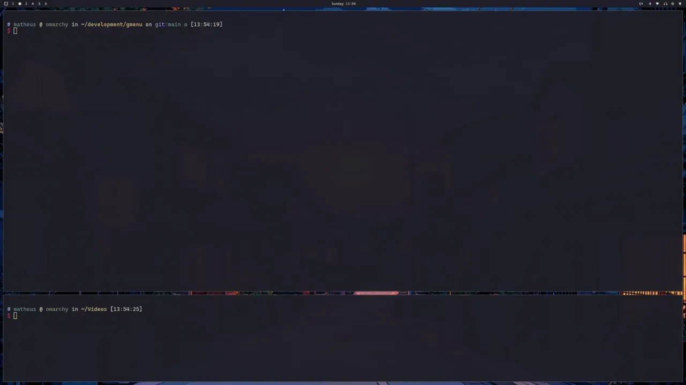

# GMenu - My Own dmenu Implementation

GMenu was written in an afternoon to solve the very annoying problem of having
a very simple TUI menu that can be configured and integrated into shell scripting.

Context: I wanted to copy the `omarchy` setup with it's simplistic and cool menus
triggered by actions on the `waybar`. However, due to installing `hyprland` on
a system that already had an app launcher, I did not want to install `walker`.

If you just want a simple `demnu` that can either be configured through a TOML file,
or options passed in from stdin, then this is for you.



**Note**: The font and styling are NOT concerns of `gmenu` - you can use your terminal
combined with `hyprland` to change fonts, placing and sizing of the menu.

## dmenu Mode

```bash
echo "Option One\nOption Two\nOption Three" | gmenu --dmenu --title "Ayo"
```

The above will simply return the selection.

## TOML Mode

You can use a TOML file to configure the options and what command to run for each
option selection.

Example of `config.toml`

```toml
[title]
name = "Power Settings"
icon = "some-image-path.jpg"

[[items]]
name = "shut-down"
text = "󰐥 Shut Down"
command = "echo"
args = ["Shutting Down..."]

[[items]]
name = "restart"
text = "󰤁 Restart"
command = "echo"
args = ["Restarting..."]

[[items]]
name = "lock"
text = " Lock Screen"
command = "hyprlock"

[[items]]
name = "screen-saver"
text = "󰹑 Screen Saver"
command = "echo"
args = ["Screen Saver..."]
```

Then just pass the config through `--config-file`:

```bash
gmenu --config-file config.toml
```

## Changing Appearance

As this menu is simply a TUI, it doesn't have any functionality to change text and
font sizing.

However, you can achieve a different looks and feel with `hypr` combined with your
terminal theme configurations.

For example, here's the `hyprland` window rules to make the windows floating:

```conf
windowrule = match:class gmenu, float on, size 400 500, center on
```

Which I combine with the following `allacrity` theme settings:

```toml
general.import = [ "~/.config/alacritty/alacritty.toml" ]

[font]
size = 12
```

In summary, I just make the `gmenu` window centered-floating, then have a different
`allacrity` theme which is the same as my usual one, only changing the font size.

**Note** that you need to make sure you have the `gmenu` class as per the `hypr`
window rules. Take a look at the comments in the following secions.


### Running With the Toml Config and Better Look and Feel

```bash
alacritty \
  --class gmenu \
  --config-file=/home/matheus/.config/alacritty/alacritty-menu.toml \
  -e /bin/bash -c '/home/matheus/.cargo/bin/gmenu --config-file /home/matheus/development/gmenu/sample_configs/power.toml'
```

Or whatever the equivalent is for your terminal emulator. You need the class!

### Running With dmnu Mode

Since the `gmenu` outputs the selection on `dmenu` mode, you can simply do something
like


```bash
selection="$(echo "Option 1\nOption 2\nOption 3" | gmenu --dmenu --tile "My Title")"
```

Then the result will be stored in `selection` in your scripts.

However, if you want the extra look and feel from `hypr` and your terminal
emulator, you will need a wrapper script with something like the following:

```bash
OUTPUT_FILE=$(mktemp)
alacritty ... -e /bin/bash -c 'gmenu ... > '"$OUTPUT_FILE"

alacritty \
  --class gmenu \
  --config-file=/home/matheus/.config/alacritty/alacritty-menu.toml \
  -e /bin/bash -c '/home/matheus/.cargo/bin/gmenu --config-file /home/matheus/development/gmenu/sample_configs/power.toml > '"$OUTPUT_FILE"

selection=$(cat "$OUTPUT_FILE")
rm -f "$OUTPUT_FILE"
```
